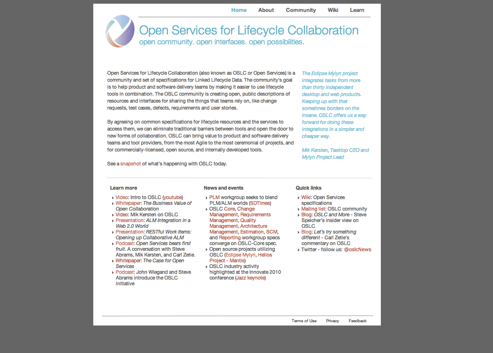
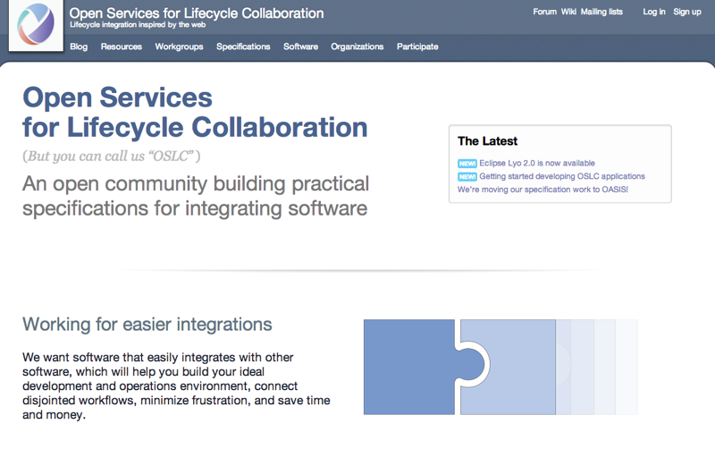

I'm taking another whack at the website for the [Open Services for Lifecycle Collaboration](http://open-services.net/) community. And I'm going to be doing it in public, right here.

Read on.

## A redesign? Why?

[Our current digs](http://open-services.net/) are a bit of a mess, that's why. I should know: I designed most of it.

A couple of years ago, we had like 5 html pages and an unlocked wiki where some awesome folks wrote some specs:

And here's where we are these days:

Now we've got a whole bunch more (roughly in the order that they were added):

- [A blog](http://open-services.net/blog/) with all the latest news
- [A forum](http://open-services.net/forums/), where anyone can ask a question about OSLC
- [A steering committee!](http://open-services.net/workgroups/steering-committee/) (and a whole lot more legal documents)
- [An updated wiki](http://open-services.net/wiki/) to support a more structured community
- Comprehensive and interconnected lists of the [working groups](http://open-services.net/workgroups/), [specifications](http://open-services.net/specifications/), [software](http://open-services.net/software/), and [organizations](http://open-services.net/organizations/) behind our community
- A growing list of [tools and resources](http://open-services.net/resources/) to help you learn more about OSLC and use it yourself 
- A [guide for developers to create OSLC applications](http://oslc.github.io/developing-oslc-applications/)

I view these as mostly a good thing! But when you dive into the details, there's a lot going on.

Displaying it all is a mess; it's tough to know quickly what's going on, where it's happening, and how you can contribute; names are haphazard (Is it "CM v2" or "OSLC Change Management version 2.0"?); there's a lot of relationships between content, but that's not always clear; and there's a growing pile of outdated content that we can probably clean up.

I'd like to clear that all up as best I can.

In the process, I'd like to also meet these goals:

- have a simpler design that can server as a flexible framework for OSLC assets. For example, the [Eclipse Lyo](http://eclipse.org/lyo/) site could surely use a refresh, too
- implement that design with a more flexible, modular code base
- I'd love to make the site faster; I'm reasonably sure I can make that happen.
- At the same time, improve the site's accessibility and make better use of progressive enhancement to make sure anyone that needs our content can get it
- In the end, I'd like this site on Github to remain as a style guide and test area for the main site

## Public? Why?

So you all can keep me honest. I'm going to discuss all the big things in [Github Issues](https://github.com/OSLC/redesign/issues) so everyone can have their say.

Plus, it'll be more fun this way.