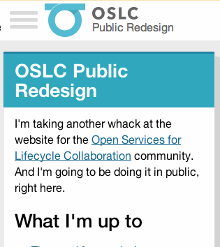

In [discussing why I wanted to redesign](./why.html) I noted a few important goals (paraphrased):

> + have a simpler, more flexible design;
> + implement that design with a more flexible, modular code base;
> + improve the site's overall accessibility and make better use of progressive enhancement to make sure anyone that needs our content can get it;
> + make the site faster;

I believe the best way to meet these goals is to design with a *mobile-first design* with a *progressive enhancement architecture*. 

## Mobile first

In 2009, [Luke Wroblewski laid out the big arguments](http://www.lukew.com/ff/entry.asp?933) for starting with a small-screen design:

1. Internet usage on mobile devices is growing at an insane pace, and mobile devices allow you to reach more people — if not now, then soon;
2. With a smaller screen, mobile forces you to focus on the most important content and interactions;
3. Mobile devices have unique capabilities (geolocation, touch inputs, etc.)

Given that our current site has a lot of excess content and functionality, I'm particularly interested in point #2, upon which Luke expanded in [a later post](http://www.lukew.com/ff/entry.asp?1117). First, on how it helps you focus:

> Losing 80% of your screen space forces you to focus. You need to make sure that what stays on the screen is the most important set of features for your customers and your business. There simply isn't room for any interface debris or content of questionable value. You need to know what matters most. In order to do that you need to really know your customers and your business. Which is good design 101. Designing for mobile forces you to get there -like it or not.

And how it can be liberating: 

> The onset of many networked consumer devices with different capabilities and limitations has begun to open a lot of people's eyes to the fact that Web sites don't have to look and act the same in every browser. In fact, they shouldn't. Designing for mobile first establishes that up front. How you present your key actions and information on mobile is likely to be different than the desktop. And that's ok.

Brad Frost [summarizes it another way](http://bradfrostweb.com/blog/web/mobile-first-responsive-web-design/):

> The mobile web is far more restrictive, eclectic and unstable than other contexts. The mobile context is hazy. Is the user on the go or on the couch? Are they on WiFi or EDGE? By first creating an experience that prioritizes a worst-case mobile scenario, you ensure that your users will be able to accomplish their goals despite a lot of factors working against them. **In short, if you can support the mobile web, you can support anything.**

Design for flexibility and performance? Cut the cruft? Reach more people? Sign me up!

(There's lots more. LukeW literally [wrote the book](http://www.abookapart.com/products/mobile-first) on the subject.)

## Progressive Enhancement architecture

The idea that we're starting with a mobile layout and *assuming* that's the worst case (Even if that's not entirely fair; I'd say that Android Chrome and iOS Safari are among the most advanced browsers *ever*.) leads naturally to using progressive enhancement to add on the useful bells and whistles when a browser supports it. 

From The Filament Group's excellent book, [*Designing With Progressive Enhancement*](http://www.peachpit.com/articles/article.aspx?p=1586457): 

> …the bottom line is that people use a wide range of browsers, platforms, and devices in their daily lives, and they expect their favorite websites and applications to work seamlessly across the lot. Building sites that work only in a handful of specific browsers isn’t a realistic approach when facing this increasingly complex universe of devices, especially when progressive enhancement provides a way to build sites that will work anywhere, for everyone.

They round up the following benefits to using progressive enhancement ([among others](http://www.peachpit.com/articles/article.aspx?p=1586457&seqNum=3)):

+ It allows for universal access.
+ It promotes coding clarity: thinking from the bottom up encourages cleaner and more modular code.
+ It keeps things centralized and simple, allowing organizations to maintain a single, unified codebase

Again, these line up well with my stated goals for the redesign.


## A brief case study: this site's primary navigation

When I [posted some rough wireframes](./wireframes.html), I noted:

> These are obviously just a rough framework; and the devil, as always, will be in the details of the implementation.

When it comes to mobile-first design with progressive enhancement, there are *a lot* of details.

Here's the wireframe I posted with the primary navigation on the left-hand side (**#1**).

[](./images/wireframes/basics.png)

That's for a desktop-sized wide screen though. How do we flip that, starting with the small-screen experience and working up to the desktop-sized layout?

At its core, a navigation area is 

+ a list of links
+ often there are logos
+ often there's a primary action or two like search or logging in

Ya know — *navigation* stuff. 

Of course, there's a huge variety of ways to do that. Brad Frost has handy collections of responsive navigation patterns, both [basic](http://bradfrostweb.com/blog/web/responsive-nav-patterns/) and [more complex](http://bradfrostweb.com/blog/web/complex-navigation-patterns-for-responsive-design/) that's worth exploring.

### Level 1: No Script

The base experience is as simple as it gets: a list of links at the top of the page.


This is more-or-less a "do-nothing" solution that also happens to be bulletproof. 

This also expands in width naturally, so it'll still function perfectly well (if ungainly) if something goes wrong with the JavaScript on a larger screen. 


### Level 2: Adding some moves

One issue with the "do-nothing" approach is that it quickly takes up a huge amount of vertical space as you add more links.

A few ways you can work around that:

- have a visible skip-to-main-content link right at the top of the page
- move the navigation to the bottom of the page and have a "skip" link to that

I may still do either of those eventually. 

Another option is introducing a toggle that uses JavaScript to collapse the navigation.


That works! But we can also add a bunch of animations to make it even more fun:




### Level 3: larger tablet-ish screens

As the screen gets wider, the single-column list of links starts looking kind of junky. 

I could make the menu items move into multiple columns. But I think it makes sense to start moving toward our eventual sidebar navigation; however it's too narrow to have it visible permanently.

We've already introduced a toggle navigation for the smaller screen, so we can adjust that to slide the whole menu bar in from the left, in a variation of the very popular "off-canvas navigation" pattern:


(Psst these .gifs are made with [LICEcap](http://www.cockos.com/licecap/), which is awesome.)


### Level 4: even larger desktop-ish screens

Once the screen gets quite a bit wider, I think we've got room for the primary navigation to stick around permanently in the sidebar. When the window gets wide enough, we hide the menu toggle, lose the header, and bump the main content over to make room for the menu:


Now we're finally close to where I wanted to be with my initial wireframes. 


## Worth it

If what I've described above sounds like a lot more work than just making a simple navigation sidebar, well, you're right! But along the way I've built a useful and (hopefully) delightful menu that is accessible to pretty much everyone and usable on an enormous range of devices.

So, sure, it's more work and a lot of testing. But given the results, what's not to like?


## Aside: "Cutting the mustard" and Modernizr

The web team at the BBC have [a great JavaScript snippet that they call "cutting the mustard"](http://responsivenews.co.uk/post/18948466399/cutting-the-mustard) that can clarify if a browser is reasonably modern or not:

```
if('querySelector' in document
  && 'localStorage' in window
  && 'addEventListener' in window) {
    // bootstrap the javascript application
}
```

I'm using that here along with the [Modernizr feature-detecting framework](http://modernizr.com/). Every page gets some baseline styles and the following JavaScript:

```
<script src="/path/to/modernizr.js"></script>
<script>
Modernizr.addTest( 'mustard', 'querySelector' in document && 'localStorage' in window && 'addEventListener' in window );
</script>
```

That adds a `Modernizr.mustard` property with the results of the test. It also adds a class to the `html` element of `class="mustard"` if the browser is fairly recent (IE9+, Chrome, Safari, Firefox, etc) or `class="no-mustard"` otherwise.

That gives you a lot of power using CSS alone to beef up any part of your site:

```
.navigation {
  /* basic styles */
}

.mustard .navigation {
  /* fancy, possibly JavaScript-dependent styles */
}
```

However, I'm choosing to break out those enhanced styles into their own `.css` file and [use Modernizr's `load()` method](http://modernizr.com/docs/#load) to inject that file if the browser 'cuts the mustard':

```
<link rel="stylesheet" href="/path/to/basic-styles.css" />
<script>
Modernizr.load([{
  test: Modernizr.mustard,
  yep: ['path/to/fancy-styles.css', '/path/to/more-fancy-scripts.js']
}]);
</script>
```

That makes the initial page load super quick and also keeps scripts and styles small for the older, wheezier browsers. Then we add the fancy stuff only when the browser supports it.

Speaking of browsers, here's what I regularly have open on my Mac while building this stuff:

- **Firefox 3.0**: This relatively ancient browser fails to cut the mustard, doesn't support CSS animations or transforms or gradients, doesn't do border radius (without `-moz` prefix, at least), and doesn't support media queries. In short, it's almost Internet Explorer 8 without having to run a virtual machine. If it works here, I'm probably OK.
- [**Duo**](https://itunes.apple.com/us/app/duo/id777886035?mt=12): I should really have a phone and a tablet running the site all the time, but this app lets you have two small Webkit browsers side-by-side, so it's handy for working on the phone-ish and tablet-ish sized layouts
- **Chrome**: It's got the best debugging tools and is pretty much as advanced as it gets
- **Firefox (current)**: CSS preprocessors and [tools like Autoprefixer](https://github.com/ai/autoprefixer) smooth over many browser inconsistencies already, but Firefox's layout engine is, in general, vastly less forgiving of CSS screw-ups than Chrome/Safari/Opera, so it's useful to check that everything is up to snuff here.