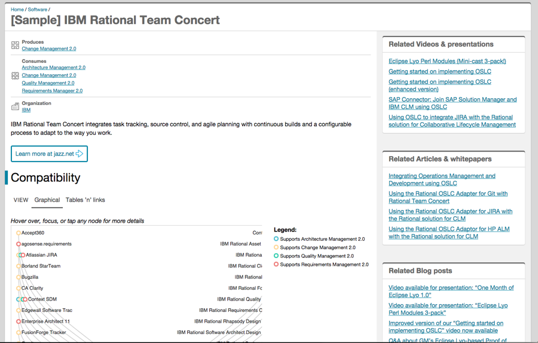
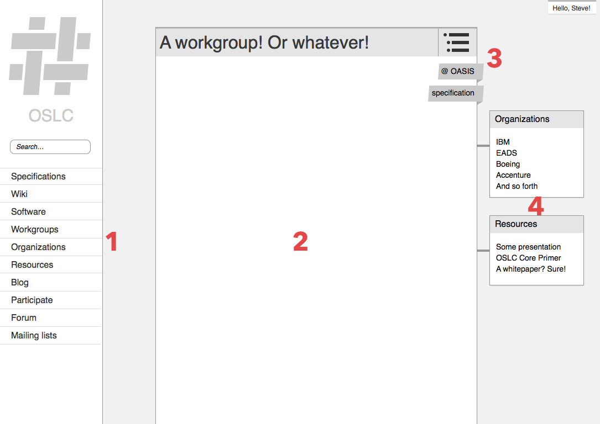
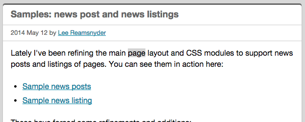
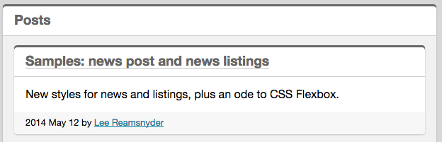
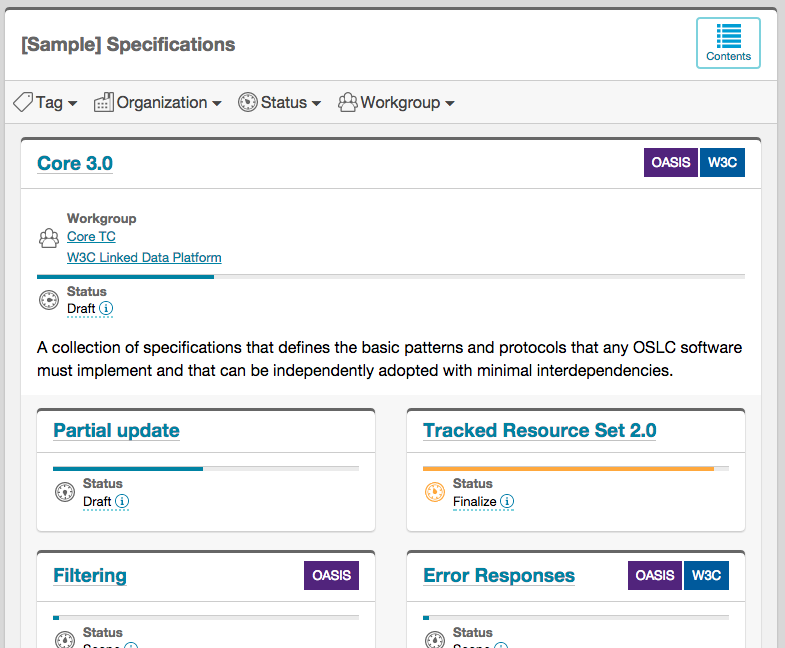
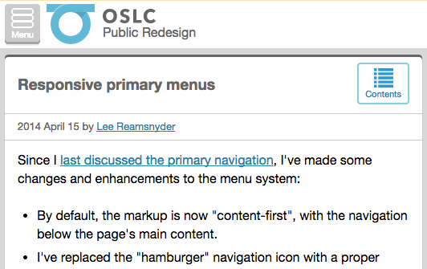

If you've been to this site at any previous point, you might notice that things look a bit different now. 

A bit less constrained, perhaps. Allow me to explain.

I was working out [a sample OSLC-enabled software page](../samples/software.html) with a nice fat diagram and [Steve noted](https://github.com/OSLC/redesign/issues/21#issuecomment-57531282) that it would be nice if the content area could get wider so that the diagram and its legend could sit side-by-side.

Here's how it looked at that point, with the diagram not fitting in its allotted space:  

"But if I let the main panel get wider," I protested to myself, "there wouldn't be room for a sidebar with the related elements!"

Wait. Who cares about sidebars? Oh, right. [Nobody](http://www.nngroup.com/articles/f-shaped-pattern-reading-web-content/).

Let's rewind just a bit more.

In [an earlier post where I showed some early wireframes](./wireframes.html), the content of every page was wrapped up in an element that I called a "card" (number 2 below):

I liked having a primary content panel for a couple of reasons:

- It's a useful spatial construct: your content goes *here*;
- I thought it might be useful to constrain the total width of the content area and keep line lengths from getting too long (and therefore harder to read);
- Cards are a [hot UI trend right now](http://www.subtraction.com/2014/08/26/what-is-a-card/).

Accordingly, *everything was a card*!

The main content is a card!  

Lists of posts are cards in cards!  

The [sample Specifications page](../samples/specifications.html) had cards in cards in a card!  

At that point, it's a bit much; [such explicit visual nesting is a heavy and probably unnecessary way to show the hierarchy of the page](https://developer.appway.com/screen/ShowSingleRecipe/selectedRecipeId/1414114838103). 

For the listings and sub-listings, stacks and collections of cards makes some sense, I think. The elements are fairly small, the nesting makes some sense if used sparingly, and it invites scrolling and flicking through the collections. Those can stick around.

But for every page's primary content, a card just wasn't making a lot of sense. It has to go.

Throwing out the primary visual metaphor you've been working with has some consequences, but it was time to live dangerously. When offered that last card, I decided to say “I’ll stay”.

<iframe width="420" height="315" src="//www.youtube.com/embed/HkzMA1jrm00" frameborder="0" allowfullscreen></iframe>

Let's do some before-and-after, shall we?

Just from that:

- The main content is no longer wrapped in a card (duh, that's what we've been talking about)
- Without the card wrapper, that frees up something like 40px of space on the margins, which is especially valuable for small screens
- The main banner has a splash of color and some depth to separate it from the main content. I expect my color choices will change, particularly when we [settle on a new logo](https://github.com/OSLC/redesign/issues/1).
- The navigation buttons for the main menu and table of contents are now better integrated with their banner areas
- Instead of artificially constraining the width of the content area, I now only constrain paragraphs, list items, quotes, and notices. Tables, code blocks, videos, and diagrams will expand to fill the available horizontal space.

There's more changes, [which I've detailed in this commit](https://github.com/OSLC/redesign/commit/a0b2cbffa4928142c01c81d150bcd0b4b2f6d252), but those are the major points.

[Let me know what you think in Issue #24](https://github.com/OSLC/redesign/issues/24) or open a new issue if you see something that's broken!