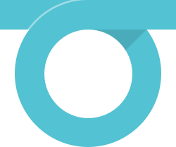
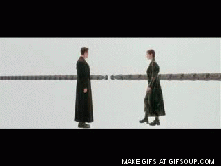

[Our oldest issue](https://github.com/OSLC/redesign/issues/1) has been how—and if!—we should approach updating our logo.

### Quick recap

Here's our current logo:

As I've [noted](https://github.com/OSLC/redesign/issues/1) [elsewhere](./logo.html), I think it has some problems:

- it's oddly-shaped
- the shapes don't resize very well
- it has a lot of colors, making it difficult to use on some backgrounds

In response to these issues, I created a variety of alternative concepts. There's this concept that I call “the weave”: 

It's OK.

There was also this loopy "O" that I was rather fond of:

But that didn't get a lot of love from the community or from the OSLC Steering Committee. Someone called it “the noose”. And that's OK!

### An evolutionary alternative

After discussing the logo situation with the Steering Committee and other folks, I decided to try a different approach: **could we evolve our current logo instead of throwing it out?**

After all, we've been using our current logo for several years; why throw all of that way?

After a few hours in Illustrator ([this tutorial was *super* helpful](http://veerle.duoh.com/design/article/how_to_create_a_shutter_shape_in_illustrator)), here's where I've ended up:

Here’s what I think works:

- It's a perfect circle, so it'll be an easier fit in a variety of applications (social media avatars, merchandise, posters, etc.)
- the colors are slightly simplified: gradients are out and purple is gone, replaced with the darker hue of blue that's used extensively on [our current site](http://open-services.net) and the [Lyo site](http://eclipse.org/lyo/).
- The shapes are symmetric now, so everything is easier to construct and manipulate.
- I think it’s a bit more modern-looking without throwing out the concept of the current logo; as an evolution, it can co-exist with older materials a bit better.
- If you're a camera nerd you might appreciate that the aperture is wider open, a fitting change given the name of our organization.

So that's where I am now on the logo. [Do have your say in the comments to the open issue](https://github.com/OSLC/redesign/issues/1); I'd love to hear what you think!

### Updated color schemes too!

With a new logo comes an updated color scheme driven by the colors in the logo.

If you've been to this site earlier, you've probably see the color scheme bounce around a bunch. However, this should be—again—more of an evolution.

If you take the four colors from the logo, you'll have this wheel:

Sometimes thought you do need lots more colors.

  
*this but for colors*

I used [the technique described in this article from Viget](http://viget.com/inspire/add-colors-to-your-palette-with-color-mixing) to stretch out those four colors into a cohesive 12-color wheel:

It's handy to have 12, but for most practical purposes you don't need that many. Here's six colors, adding two more to the 4 from the logo:

That looks pretty nice, in my opinion: harmonious and not too far gone from our current site.

So that's half the battle. The next bit is to make a complete palette from those hues.

I'll spare you the details and just show you the end result:

From top-to-bottom:

- the color from the color wheel
- extra-light
- light
- middle-light
- base
- middle-dark
- dark
- extra-dark

The “base” version of each color is sufficiently neutral that you can safely use black (`#000`) or white (`#FFF`) text on it and the contrast will pass [accessibility requirements for adequate color contrast](http://leaverou.github.io/contrast-ratio/#%23ccc-on-hsl%2886%2C%2030%25%2C%2016%25%29).

The “light” varieties will work with dark text (tested with with `#444` dark gray) and the “dark” varieties will work with lighter text (tested with `#CCC` light gray). 

If you're asking, “why would we need this?”, the answer is so you don’t have to think about choosing or creating colors if you’re building anything OSLC-related.

I've taken “don't think about it” to a useful place with [a technique stolen from Erskine Labs](http://erskinedesign.com/blog/friendlier-colour-names-sass-maps/) to put those colors in SASS map for use in the site's stylesheet.

Here's a variable that I define our our site's `_settings.scss` file:

~~~
$palettes: (
  blue: (
    wheel:      hsl(211, 47%, 62%),
    x-light:    hsl(211, 47%, 90%),
    light:      hsl(211, 47%, 70%),
    mid-light:  hsl(211, 47%, 59%),
    base:       hsl(211, 47%, 48%),
    mid-dark:   hsl(211, 47%, 36%),
    dark:       hsl(211, 47%, 24%),
    x-dark:     hsl(211, 47%, 17%)
  ),
  red: (
    wheel:      hsl(11, 63%, 64%),
    x-light:    hsl(11, 63%, 90%),
    light:      hsl(11, 63%, 73%),
    mid-light:  hsl(11, 63%, 61%),
    base:       hsl(11, 63%, 49%),
    mid-dark:   hsl(11, 69%, 42%),
    dark:       hsl(11, 71%, 36%),
    x-dark:     hsl(11, 73%, 24%)
  ),
  // … and so on …
);
~~~

Then I have this tiny helper function:

~~~
@function palette($palette, $tone: 'base') {
  @return map-get(map-get($palettes, $palette), $tone);
}
~~~

(*This requires Sass 3.3 or higher to use maps and the related map functions*)

With that in place, using one of our colors anywhere is a piece of cake, as I just have to specify the color and the general shade that I want.

~~~
a {
  color: palette(blue);

  &:hover {
    color: palette(blue,mid-light);
  }
}

.banner {
  background-color: palette(blue-alt, dark);
}

.success {
  background-color: palette(green, x-light);
}
~~~

*Super* convenient.

### Next steps

Here’s what I have planned next:

1. With the colors and logos getting settled and [a variety of sample pages to work from](../samples/), I'm going to start building out the templates to make it all work in our content management system at <http://open-services.net>
2. Right now the focus is to get the data-driven and content pages updated with the new style. That's stuff like [specifications](http://open-services.net/specifications), [workgroups](http://open-services.net/workgroups/), [the Participate page](http://open-services.net/participate/). I'd like to roll that out before the end of the year.
3. I'll follow up with updates to more complex areas like the wiki and forums; because those are more interactive areas of the site, they require much more testing.
4. I'll continue to update this site as I go. I especially want to document things like the logo, color schemes, the JavaScript modules I've written, how the SASS works. Maybe eventually talk content strategy, voice… all kinds of stuff that should be written down somewhere.

[Please open issues](https://github.com/OSLC/redesign/issues) if you see something wonky here! I'd love to hear from you! 

Stay tuned!