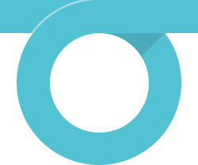
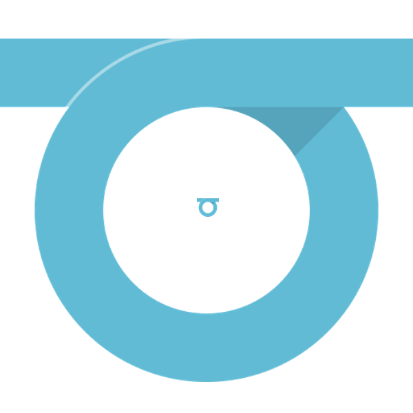

  

Got some thoughts on this?

  
Share your thoughts <a href="https://github.com/OSLC/redesign/issues/1">in the open issue about a new logo</a>.

First up, some background: here's the OSLC logo from early 2011:

I'm not sure what was going on with the gray-to-color gradients there. *Blech*. Here it is after I touched up the colors:

This "aperture" mark has served as our logo for several years now, and its colors have informed the design of our website for as long as I've been working on it.

## Problems

As a reusable logo, the aperture mark has some issues:

First, it's oddly shaped: tilted forward and taller than it is wide, it fits poorly in almost every box I've tried to put it in. It's never been the best for for social media sites that generally assume your avatar will be closer to a 1:1 aspect ratio. (Before you ask, all of my attempts to convert the same general idea to a 1:1 circle have gone poorly.)

Next, between the gradated colors and the delicate points of the curves, it loses clarity at small sizes. 

Here it is at 32 pixels: . 

At that size, the blades are kind of chunky and are *this* close to bleeding into each other. It gets worse as you go smaller; however, to be fair, many logos don't stand up to extreme resizing.

Finally, I've never had a good way to use it over non-white backgrounds. You really need a stroke or background color or shadow around the blades to keep the logo separated from the background, but the blades are so close together that strokes smash into each other, which I'm demonstrating with exaggerated effect here:

You *can* put a background behind the entire mark as I did with a variation for [Eclipse Lyo](http://eclipse.org/lyo/): 

That sort of works, but I think it emphasizes the overall oddness of the mark's shape and, ironically, makes the logo look less than &ldquo;open&rdquo;.

## A new #idea

Given all these issues I was having with the aperture mark, I wanted to see if I could do better.

After a few rounds of sketching, I zeroed in on this basic concept:

Here in the same colors as our current logo:

And in a more vibrant palette that I've become fond of (ie, I don't care for purple): 

Here's what I like about it:

- the 'woven' design reflects our community goal of not only integrating software, but also bringing together folks from many disciplines to do so;
- but it's not a "tight" weave, which jives with our goal of building loose connections
- our work is "inspired by the web", and the slanted lines ("**//**") remind me of those in web protocols ("http:**//**"), and vocabularies and schemas often have a hash "#" in their URIs;
- like all the cool kids, we're already using "#OSLC" on Twitter

And here's what still worries me:

- 4 colors, while not exactly excessive, is still a lot of colors for a logo and makes it more complex to reproduce accurately.
- We're still using small gaps between shapes, which means I'll have to do a lot of pixel-level adjustments to make sure the details hold up when it's small. However, it does hold up reasonably well with no special effort: 
- It will also require adjustments at larger sizes: I've found that when it gets too large it looks less like a weave and more like a bunch of floating rectangles. I don't think this is insurmountable, but it's an issue.
- As with the aperture mark, the complexity of the shape and variety of colors work against you when you need to put the logo on anything other than a white background. I've stuck it on dark gray below to demonstrate how the colors, which work well on white, start to look out of place on anything else. We'll either have to be really careful, or we'll have to come up with endless variations that work with different backgrounds.

Best of luck to whoever has to find 5 colors that play nice together. Four is brutal enough.

Finally, while I'm fond of the *implied* depth, the logo is a bit flat. No doubt some will want to jazz it up, as some chuckleheads in the office did on my whiteboard with an extra-3D, extra-textured, extra-[arrowed](http://www.hrwiki.org/w/images/thumb/f/f7/Arrowed_Full.png/180px-Arrowed_Full.png) version:

Har har, guys.

## A loopier option

Although I like the concept of the "#" mark above, I still wanted to see if I could get to an even simpler shape that might be easier to work with.

After another few rounds of sketches, I started to like the idea of a single line as an abstract way to represent a connection – between ideas, people, software, whatever – along with an open loop to make the connection with style. Here's a first pass:

Oh, duh: it's a **giant "O"**. This could work!

Here's the current version after I beefed it up, paid closer attention to the proportions, and added color: 

Much better.

One of the more charming aspects of this concept is how well it works with any color, which means this logo will be **flexible enough to use almost anywhere**:

It's also **simple and clear** enough to work well at both very large and very small sizes:

In a happy accident, the proportions are awful close to the capital "O" in Avenir Next Bold, so the choice of font for a wordmark is pretty easy:

All told, although I'm fond of the "#" concept, I also like the loop concept and I think that it'll be **easier to use** and **more flexible** in the future. So I think overall it's the better match.