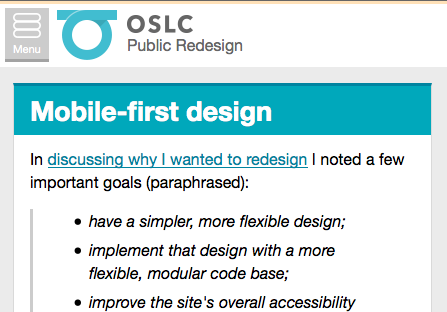
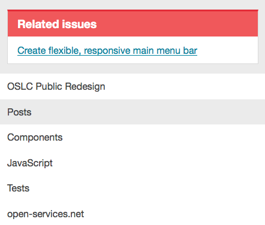
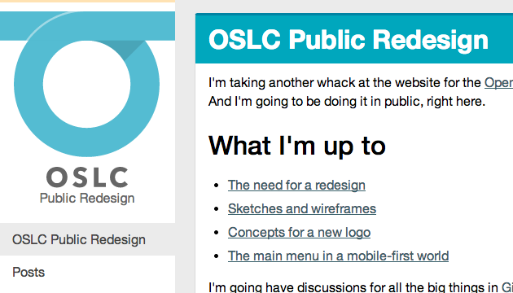
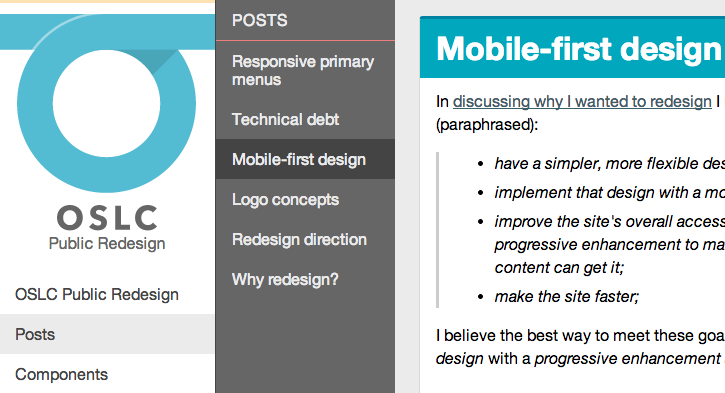
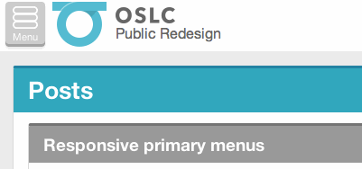

Since I [last discussed the primary navigation](./mobile-first.html), I've made some changes and enhancements to the menu system:

- By default, the markup is now "content-first", with the navigation below the page's main content.
- I've replaced the "hamburger" navigation icon with a proper button that says "Menu"
- I've added some functionality to handle sub-navigation in a reasonable amount of space on smaller screens.

Read on for more details.

### No script.

I previously thought it best to just have all the links at the top of the page:


That's a good default, but with a bunch of primary links, we've pushed the actual page content way, way down. Possibly off-screen. And we haven't even added the secondary menu.

I think the simplest, idiot-proof solution then is to have the default markup have the navigation links below the page content. Here that is in Firefox 3, my outdated testing browser of choice:



In this case, the "Menu" link is just a jump link to `#nav`, which is below the content:



Not the prettiest, but it's totally accessible and it works.


## Started from the bottom, now we're here

With the worst-case scenario out of the way, we can start to get flashier.

First, I move the `#nav` block above the content. There's no reliable way to change markup order with CSS, so that's gotta be JavaScript:

```
$('#nav').insertBefore('#main');
```

But I don't want it taking up all that space, so I position the navigation absolutely and slide the main content over it. Then the **Menu** button slides the content down to reveal the menu:


Beyond that, the main menu behaves as it did before. For tablet-size screens, we slide everything in from the left:


And on a larger screen, the menu becomes a persistent sidebar:



#### Protip #1: smooth animations 

Sliding around `#main` like that is potentially a huge number of pixels for the browser to shove around, so I'm trying to make sure it moves as smoothly as possible. To do that, I'm animating the CSS `transform: translate(Xpx, Ypx)` property. [Browsers can only smoothly animate 4 things:](http://www.html5rocks.com/en/tutorials/speed/high-performance-animations/) translated position, scale, rotation, and opacity.

This results in a much smoother animation than either animating the CSS `top` value for `#main` or (worse) animating the `height` property of `#nav` to shove `#main` down, which I was doing earlier.

#### Protip #2: pointer events on translated buttons

So here's something that was driving me bonkers for a while. When you clicked on some areas of the **Menu** button, nothing would happen:


So what's happening is I'm `translate()`ing the button down to make it look like it's being physically clicked. I also have some script that waits for you to click that button, and then opens up the navigation:

```
$('#navToggle').on('click', toggleNavigation);
```

The problem is, for the browser to register a `click` event, you have to `mousedown` *and* `mouseup` on the same element. With the translation, sometimes that doesn't happen. In the animation above, I believe I'm getting the `mousedown` on the button, but the `mouseup` is on the icon, which is a child element of the button. So no `click` event triggers.

The solution is in the obscure CSS property `pointer-events`. When set to `none`, any mouse events on an element will get passed up to the parent. So I've got buttons with this CSS:

```
.btn > * { pointer-events: none; }
```

And that seems to resolve the issue.


## Adding the secondary menu

In my [initial wireframes](./wireframes.html), I planned on there having to be a secondary navigation menu for some areas of the site. That's easy enough to do with large screens: just add more sidebar!



Pretty easy to deal with the tablet layout, too. We're already sliding it out of the way, so just slide it some more.



But what about small screens?

- **Stack 'em vertically?** Nah, that takes up way too much vertical space.
- **Keep 'em side-by-side?** Nah, there's not enough room. It looks super cramped.
- **Don't bother with subnavigation?** Nope, important controls will probably end up there
- **[Left-to-right drilldowns](http://bradfrostweb.com/blog/web/complex-navigation-patterns-for-responsive-design/#ol-left-to-right)?** Not a great fit for my needs; if you're deep in the site, do you start all the way to the right?
- **What about [accordions/toggles](http://bradfrostweb.com/blog/web/complex-navigation-patterns-for-responsive-design/#multi-toggle)?** That could work, but that seems excessive to need to expand only two levels

So my priorities were:

- obvious controls
- relatively equal treatment of the primary and secondary menu
- a sensible way to highlight the secondary menu when the nav first opens

I found some inspiration in the so-called ["Carousel+" pattern for complex responsive designs](http://bradfrostweb.com/blog/web/complex-navigation-patterns-for-responsive-design/#carousel-plus) and in the ["tabs"](http://enyojs.com/mochi/Mochi%20tabs%20comps.png) concept from the [gorgeous, abandoned redesign of webOS](https://github.com/enyojs/mochi/wiki). Here's where I am right now:


So you have a tab/carousel/thing that lets you go between the main and secondary menus. The menus have titles to improve clarity. We open to the secondary menu by default. And it's all nicely animated. Not too shabby.