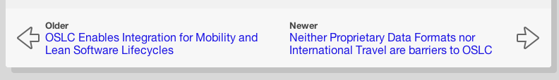
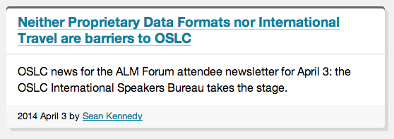
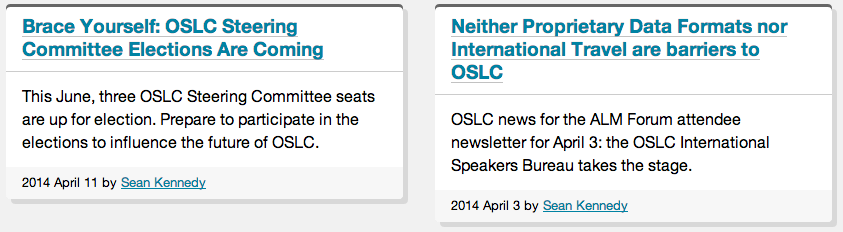
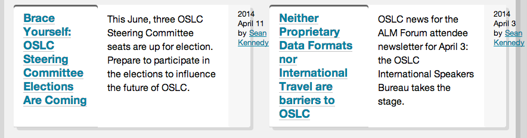
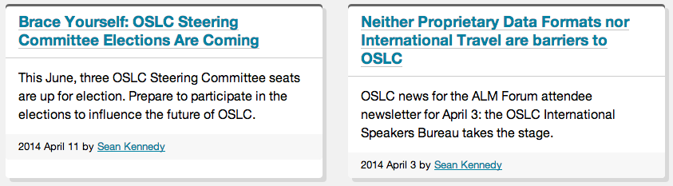
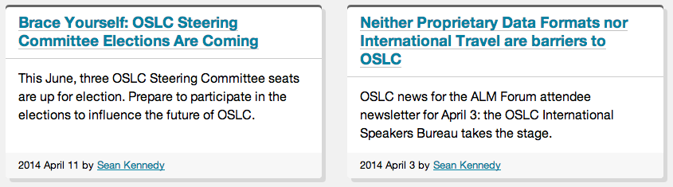

Lately I've been refining the main page layout and CSS modules to support news posts and listings of pages. You can see them in action here:

- [Sample news posts](../samples/news.html)
- [Sample news listing](../samples/news-listing.html)

These have forced some refinements and additions:

- I've added `.footer` (at the bottom) and `.deck` (strips under the headline) to the [`.card` module](https://github.com/OSLC/redesign/blob/gh-pages/_harp/css/_components/_card.scss)
- Card `.footer` is for local navigation and can contain either [Simple pagination](https://github.com/OSLC/redesign/blob/gh-pages/_harp/css/_components/_pagination.scss) or [Sequences (previous/next links)](https://github.com/OSLC/redesign/blob/gh-pages/_harp/css/_components/_sequence.scss):
    
    
- In news listings, I put the byline in `.footer`; this is inconsistent with the above bullet, but I like how it puts greater emphasis on the summary/description (plus I think it looks nicer): 
    
    
- I've reduced the number of [grid ratios](https://github.com/OSLC/redesign/blob/gh-pages/_harp/css/_settings.scss#L84-L89); instead of a full 12-column symmetrical grid ([like Foundation](http://foundation.zurb.com/docs/components/grid.html)), there's now only full-width (100%), half-width, a "major" column (~70%), and a "minor" column (~30%). I'm betting this will be flexible enough. One benefit if chopping out all the extra grid options (*how often will I use a 5:7 ratio?*) is that the CSS shrank about 10% for the base CSS and ~30% (!!) for the enhanced CSS. 
- Related elements for a page now go in an `aside.relationships` block that becomes a sidebar at larger page widths.
- Breadcrumbs! I put nearly [zero work](https://github.com/OSLC/redesign/blob/gh-pages/_harp/css/_components/_breadcrumbs.scss) into these, but I have plans to make them cooler eventually.
- Links in `.card` headings [use a gradient background to fake an underline](https://github.com/OSLC/redesign/blob/gh-pages/_harp/css/_components/_card_enhanced.scss#L32-L43), which I think looks nicer than `text-decoration: underline` at larger text sizes

### CSS Flexbox is awesome <small>(Brief aside)</small>

If you haven't tried out the [Flexbox Layout](http://css-tricks.com/snippets/css/a-guide-to-flexbox/) CSS module, it provides a lot of solutions to layout problems that used to be quite tricky. [Phillip Walton wrote up a little guide](http://philipwalton.github.io/solved-by-flexbox/) that covers some of the biggies. I'm already using his suggestions for ["Sticky" footers](http://philipwalton.github.io/solved-by-flexbox/demos/sticky-footer/) (the main body element grows to fill the browser height minus the footer) and [the classic `.media` object](http://philipwalton.github.io/solved-by-flexbox/demos/media-object/).

It's also handy for all kinds of stupid layout tricks. For example, my pagination styling is just an inline list with some spacing between items:


That's totally acceptable as is! But it'd be nice if the items would space themselves out to fill the width of their container. 

Without flexbox, you'd probably have to use JavaScript and calculate the width of the containers, the width of all the items, and apply inline margins to each item. And then it'd break if you resized anything.

With flexbox, use two lines of CSS:

```
.pagination {
  display: flex;
  justify-content: space-between;  
}
```


Like magic!

Flexbox is also great for making elements be equal size when they normally wouldn't  be. For an example, here are two cards side-by-side in a post listing:



I could figure out how to equalize their heights with JavaScript, but it wouldn't be simple; you can't just apply equal `height` or `min-height` to the cards, nor can you just match up the heights of the middle `.content` blocks as the headers or footers can be variable heights. Flexbox lets you do all this without, ya know, *math*.

I'm already using [flexbox for the grid layout](http://philipwalton.github.io/solved-by-flexbox/demos/grids/), and the default behavior for `display: flex` items is to grow in height to fill the container. The trick here is to specify *how* those elements should grow.

First, we set the `.card` to be a flexbox container:

```
.card {
  display: flex;
}
```



So now they're the same height, but, uh, that isn't right. The default behavior of children of a `display: flex` box is to lay themselves out in one horizontal row. That's an easy fix:

```
.card {
  display: flex;
  flex-direction: column;
}
```

In flexbox parlance, we're changing the *main axis* direction. I find the keywords a little confusing compared to grids or spreadsheets as `flex-direction: row` (the default) gives you easy multi-*column* layouts, while `flex-direction: column` puts the items in a single vertical row … unless you're using `flex-wrap`, but that's a different story.

Anyway, that change gives us this: 



Close, but the left-hand card has grown indiscriminately from the bottom, below the `.footer` element. This is why you can't just apply `min-height` to the cards. 

This is the behavior we really want:

- `.header` and `.footer` should be as big as they need to be
- `.content` (the middle portion) should be as big as it needs to be *and* it should expand to fill out the box if needed.

For `.header` and `.footer`, we're describing the default behavior of flex items, so we don't have to do anything. As for `.content`, flexbox makes this absurdly easy:

```
.card > .content {
  flex: 1;
}
```

Yeah, that's it! This says, "`.content` should be allowed to grow if needed". (I could have just gone with `flex-grow: 1`, but the `flex` shorthand also works.) You can do fun stuff with relative proportions of flex items with different `flex-grow` values on the items, but all that's needed here is to say that one element should be allowed to get larger.



It might take a little while to wrap your head around flexbox concepts, but it's so powerful that it'll soon become impossible to ignore. It's already [well-supported by two-thirds of browsers by global usage](http://caniuse.com/flexbox). 

A few more tips if you're hankering to give it a try:

- I found Greg Smith's [Dive Into Flexbox](http://bocoup.com/weblog/dive-into-flexbox/) guide to be a great introduction to all the flexbox concepts. You can also find more resources at the [CSS Tricks guide](http://css-tricks.com/snippets/css/a-guide-to-flexbox/).
- The ideas for flexbox have been around for a while, but implementations have varied wildly. I recommend only working with the "modern" syntax. You can see the differences in syntax in [this article on CSS Tricks](http://css-tricks.com/using-flexbox/).
- Because of those syntax differences and the need for browser prefixes, look into [Autoprefixer](https://github.com/ai/autoprefixer), aka *[the best thing ever](http://css-tricks.com/autoprefixer/)*, which will flesh out all the differences for you. You just write `display: flex` and autoprefixer spits out `display: -webkit-box; display: -webkit-flex; display: -moz-box; display: -ms-flexbox; display: flex;` to cover everything. It's awesome.
- I strongly recommend also using [Modernizr](http://www.modernizr.com/) to test for Flexbox support and use the positive `.flexbox` class to scope its effects (like `.flexbox .card > .content { flex: 1 }`). The Flexbox test will tell you if the browser is using the modern syntax or the hybrid (IE10) syntax, but will fail for older browsers that only do the legacy syntax.
- If you're supporting IE10 and its 'tweener' syntax, test carefully. For example, I've found I often have to explicitly declare `flex-basis` (which becomes `-ms-preferred-size`) for IE10 when you wouldn't for other browsers. 
- IE10 and 11 have a bug where sizing a box with `flex-basis` and using `box-sizing:border-box` will not work as expected. Basically, padding and borders on flex items will break the layout. Using `max-width` or the even cooler `calc()` function [might be what you need to fix it](http://stackoverflow.com/questions/21942183/multiline-flexbox-in-ie11-calculating-widths-incorrectly).

Have fun!