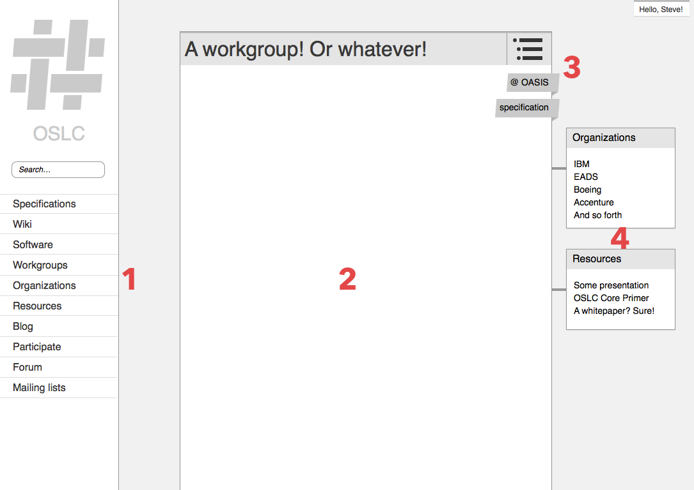

Here's some rough interface sketches that should illustrate the direction I'm headed with this redesign.

Here's the first pass, with most of the basics:

- **(1) A flexible left-hand primary navigation**: I plan on flattening most of the major navigation elements into a single global menu that combines the major site sections (blog, specs, etc), site applications (wiki, forums), and a search. Going vertical instead of horizontal gives us the flexibility to grow more: we're running low on horizontal space in the current version of the site.
- The main content on any page will reside in a **(2) main panel or "card"**, which will have a pretty consistent design everywhere in the site.
- Cards will have consistent ways to show **(3) meta-information** about the primary content, like a table of contents or tags/labels.
- The right-hand side will be reserved for content that is **(4) related to the main page content**. Ya know—sidebar stuff. I track a a bunch of relationships between pages on the site (for example, organizations that contributed to workgroups; blog posts that mention educational resources) and I hope to show those relationships consistently site-wide.

Some areas of the site like forums and the wiki will require additional layers of navigation:

- **(5) A second sidebar menu** will have major navigation or actions for the area (for example, all the main pages and actions for a wiki)
- **(6) A card-based menu** will have nav or actions for that particular content (for example, editing that wiki page)

That's a lot of menus, but I think the context of each will be pretty clear (Global → Area → Page)

I'm thinking the card as a major design element will be very flexible and reusable. For example, a listing of elements could be displayed as small cards that can be **(7) nested, listed**, **(8) filtered, or sorted** (as needed), as on this example listing of workgroups:

As you go deeper, I hope to put together pleasant ways to display all the information we have. Here's what I'm thinking for an individual OSLC implementation:

- **(9) A flexible, vertical listing of the most important information**
- **(10) a visualization** of software that can be integrated, which will hopefully be a more elegant solution than the [pile o’ tables](http://open-services.net/software/ibm-rational-team-concert/) I use now.

These are obviously just a rough framework; and the devil, as always, will be in the details of the implementation. But I think a system like this will go a long way towards simplifying the site and making it easier to find the content you need.

(Noticed that logo in the corner? [Learn more about concepts for a new logo](./logo.html).)